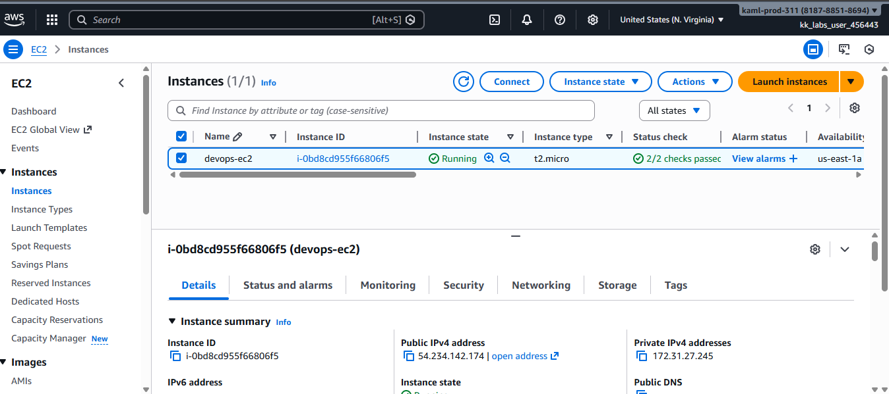
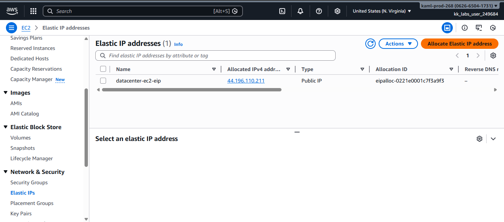
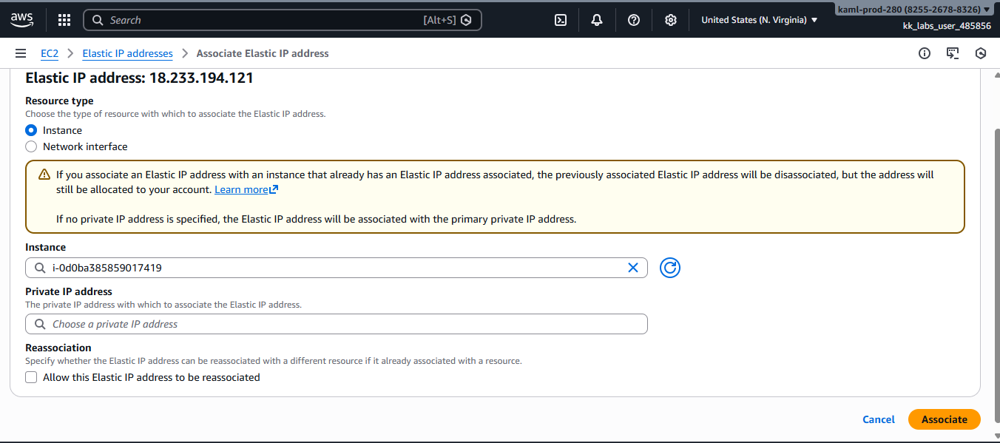
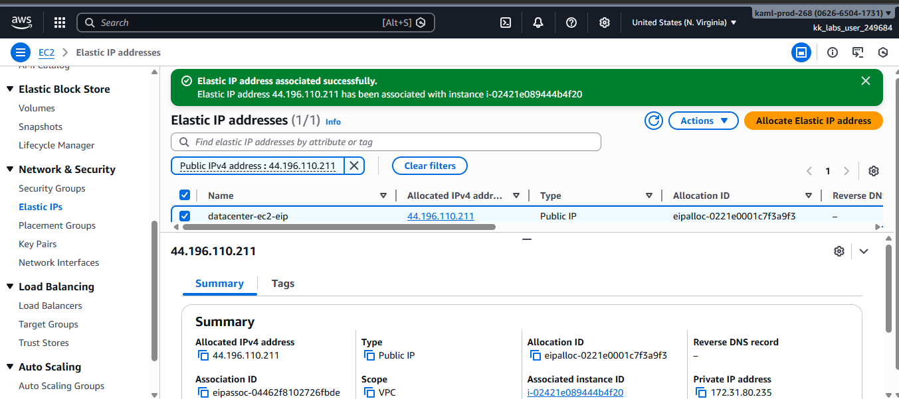
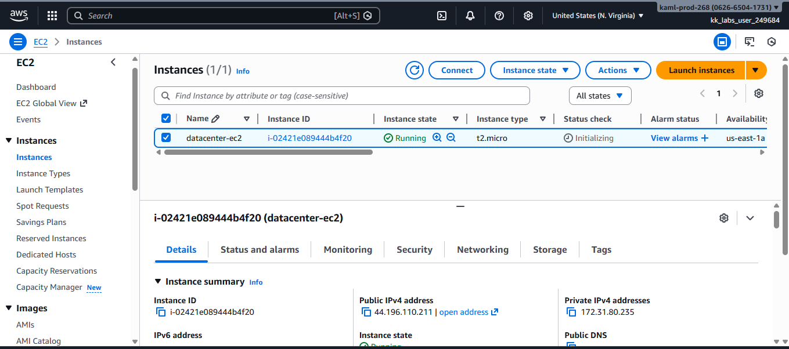

# Attach-an-Elastic-IP-to-an-EC2-Instance-on-AWS

##  What is an Elastic IP?
An **Elastic IP (EIP)** is a static public IPv4 address provided by AWS. Unlike automatically assigned public IPs, Elastic IPs remain the same even if the instance is stopped and restarted. They are commonly used for:
- Stable endpoints
- Whitelisting IP addresses
- Production workloads requiring consistent public access

### Step 1: Log in to the AWS Management Console

### Step 2: Verify the EC2 Instance

- Navigate to **Services → EC2**

- Click **Instances**

- Confirm that the instance named **`devops-ec2`** exists

### Step 3: Locate the Elastic IP

- In the EC2 dashboard sidebar, scroll to **Network & Security**

- Click **Elastic IPs**

- Select the Elastic IP named **`devops-ec2-eip`**

### Step 4: Associate the Elastic IP

- With **`devops-ec2-eip`** selected, click **Actions**

- Choose **Associate Elastic IP**

- Select **`devops-ec2`** as the instance

- Click **Associate**

### Step 5: Verify the Association

- Confirm that the Elastic IP now shows **`devops-ec2`** as the associated instance

- Check the EC2 instance details to ensure the public IPv4 address matches the Elastic IP

##  Notes
- Elastic IPs incur charges when not associated with a running instance
- Elastic IPs are region-specific and must match the instance region
- This setup is useful for workloads requiring a fixed public IP

